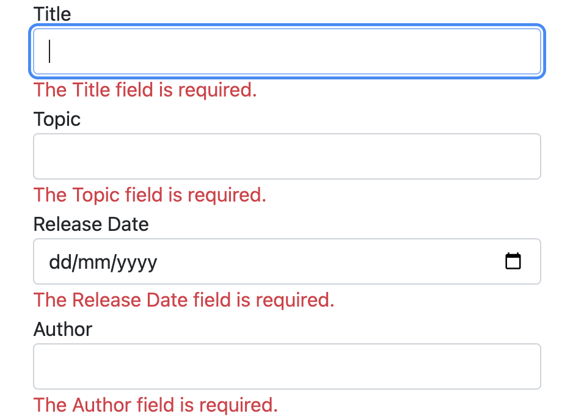

# Part 3: Add a new field and add validation to an ASP.NET Core MVC application

>This tutorial teaches how to add new fields to entities and migrate them into the database. Then we will learn how to validate properties using `ValidationAttribute`. This guide is compiled based on [Get started with ASP.NET Core MVC](https://learn.microsoft.com/en-us/aspnet/core/tutorials/first-mvc-app/start-mvc?view=aspnetcore-8.0&tabs=visual-studio-code) by `Microsoft`.

In this section Entity Framework Code First Migrations is used to:

- Add a new field to the model.
- Migrate the new field to the database.

When EF Code First is used to automatically create a database, Code First:

- Adds a table to the database to track the schema of the database.
- Verifies the database is in sync with the model classes it was generated from. If they aren't in sync, EF throws an exception. This makes it easier to find inconsistent database/code issues.

In this validation section:

- Validation logic is added to the Course entity.
- You ensure that the validation rules are enforced any time a user creates or edits a course.

Before coming to this guide, please refer to [Part 2: Get started with ASP.NET Core MVC, Connect to SQL Server database to CRUD](https://github.com/NguyenPhuDuc307/get-started-dotnet-mvc).

## Part 1: Add a new field

- **Add a Author Property to the Course Model**

  Add a `Author` property to `Data/Entities/Course.cs`:

  ```c#
    using System.ComponentModel.DataAnnotations;

    namespace CourseManagement.Data.Entities;

    public class Course
    {
        public int Id { get; set; }
        public string? Title { get; set; }
        public string? Topic { get; set; }
        [DataType(DataType.Date)]
        public DateTime ReleaseDate { get; set; }
        public string? Author { get; set; }
    }
  ```

  Build the app:

  ```bash
  dotnet build
  ```

  Run the following .NET CLI commands:

    ```bash
    dotnet ef migrations add AddAuthorInCourse
    ```

    ```bash
    dotnet ef database update
    ```

  Because you've added a new field to the `Course` class, you need to update the property binding list so this new property will be included. In `CoursesController.cs`, update the [Bind] attribute for both the `Create` and `Edit` action methods to include the Author property:

  ```c#
  [Bind("Id,Title,Topic,ReleaseDate,Author")]
  ```

  Update the view templates in order to display, create, and edit the new `Author` property in the browser view.

  Edit the `/Views/Courses/Index.cshtml` file and add a Author field:

  ```html
    <table class="table">
        <thead>
            <tr>
                <th>
                    @Html.DisplayNameFor(model => model.Title)
                </th>
                <th>
                    @Html.DisplayNameFor(model => model.Topic)
                </th>
                <th>
                    @Html.DisplayNameFor(model => model.ReleaseDate)
                </th>
                <th>
                    @Html.DisplayNameFor(model => model.Author)
                </th>
                <th></th>
            </tr>
        </thead>
        <tbody>
            @foreach (var item in Model)
            {
                <tr>
                    <td>
                        @Html.DisplayFor(modelItem => item.Title)
                    </td>
                    <td>
                        @Html.DisplayFor(modelItem => item.Topic)
                    </td>
                    <td>
                        @Html.DisplayFor(modelItem => item.ReleaseDate)
                    </td>
                    <td>
                        @Html.DisplayFor(modelItem => item.Author)
                    </td>
                    <td>
                        <a asp-action="Edit" asp-route-id="@item.Id">Edit</a> |
                        <a asp-action="Details" asp-route-id="@item.Id">Details</a> |
                        <a asp-action="Delete" asp-route-id="@item.Id">Delete</a>
                    </td>
                </tr>
            }
        </tbody>
    </table>
  ```

  Update the `/Views/Courses/Create.cshtml` with a Author field:

  ```html
    <form asp-action="Create">
        <div asp-validation-summary="ModelOnly" class="text-danger"></div>
        <div class="form-group">
            <label asp-for="Title" class="control-label"></label>
            <input asp-for="Title" class="form-control" />
            <span asp-validation-for="Title" class="text-danger"></span>
        </div>
        <div class="form-group">
            <label asp-for="Topic" class="control-label"></label>
            <input asp-for="Topic" class="form-control" />
            <span asp-validation-for="Topic" class="text-danger"></span>
        </div>
        <div class="form-group">
            <label asp-for="ReleaseDate" class="control-label"></label>
            <input asp-for="ReleaseDate" class="form-control" />
            <span asp-validation-for="ReleaseDate" class="text-danger"></span>
        </div>
        <div class="form-group">
            <label asp-for="Author" class="control-label"></label>
            <input asp-for="Author" class="form-control" />
            <span asp-validation-for="Author" class="text-danger"></span>
        </div>
        <div class="form-group">
            <input type="submit" value="Create" class="btn btn-primary" />
        </div>
    </form>
  ```

  Similarly, update the `/Views/Courses/Edit.cshtml`, `/Views/Courses/Details.cshtml`, `/Views/Courses/Delete.cshtml` with a Author field:

  Finally run the following .NET CLI commands:

  ```bash
  dotnet ef migrations add AddAuthorInCourse
  ```

  ```bash
  dotnet ef database update
  ```

## Part 2: Add validation

- **Add validation rules to the course model**

    The DataAnnotations namespace provides a set of built-in validation attributes that are applied declaratively to a class or property. DataAnnotations also contains formatting attributes like `DataType` that help with formatting and don't provide any validation.

    Update the `Course` class to take advantage of the built-in validation attributes `Required`, `StringLength`, `RegularExpression`, `Range` and the `DataType` formatting attribute.

    ```c#
    public class Course
    {
        public int Id { get; set; }
        [StringLength(60, MinimumLength = 3)]
        [Required]
        public string? Title { get; set; }
        [StringLength(60)]
        [Required]
        public string? Topic { get; set; }
        [Display(Name = "Release Date")]
        [DataType(DataType.Date)]
        public DateTime ReleaseDate { get; set; }
        [StringLength(60)]
        [Required]
        public string? Author { get; set; }
    }
    ```

    The validation attributes specify behavior that you want to enforce on the model properties they're applied to:

  - The `Required` and `MinimumLength` attributes indicate that a property must have a value; but nothing prevents a user from entering white space to satisfy this validation.

  - The `StringLength` attribute lets you set the maximum length of a string property, and optionally its minimum length.

  - Value types (such as `decimal`, `int`, `float`, `DateTime`) are inherently required and don't need the `[Required]` attribute.
  - Refer to the [System.ComponentModel.DataAnnotations Namespace](https://learn.microsoft.com/en-us/dotnet/api/system.componentmodel.dataannotations)
  
- **Validation Error UI**
  
  Run the app and navigate to the `Courses` controller.

  Select the **Create New** link to add a new course. Fill out the form with some invalid values. As soon as jQuery client side validation detects the error, it displays an error message.

  

    Above are all instructions on validate properties using `ValidationAttribute`, refer to the [ValidationAttribute Class](https://learn.microsoft.com/en-us/dotnet/api/system.componentmodel.dataannotations.validationattribute?view=net-8.0).

Next let's [Part 4: Seed the database an ASP.NET Core MVC application](https://github.com/NguyenPhuDuc307/seed-the-database).
